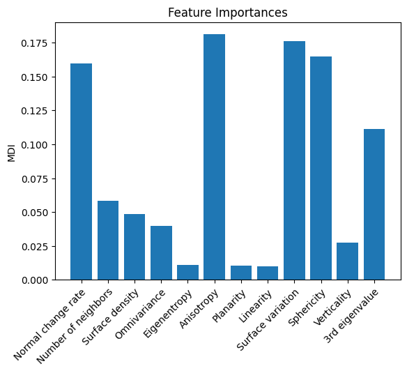
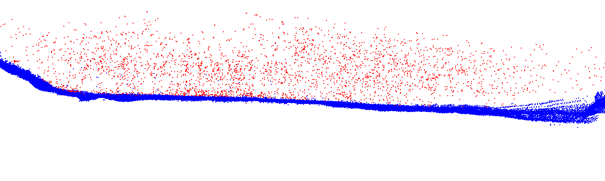
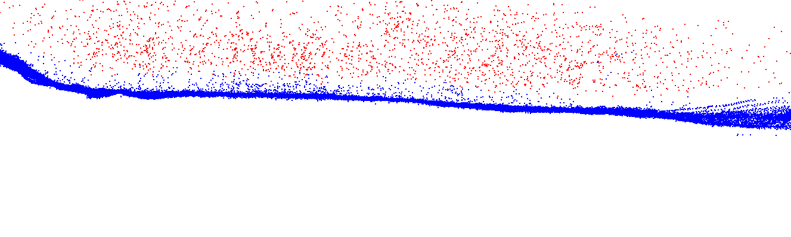
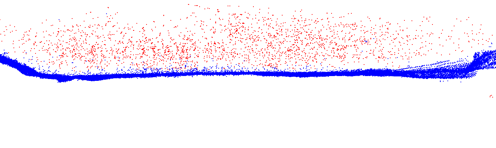

# Noisy LIDAR Classification

## The Goal

Every day autonomous vehicles use LiDAR to sense their surroundings by using a laser to create a cloud of
points. In ideal conditions, these point clouds are extremely accurate and play a large role in a vehicle’s decision-
making. However, under snow or rain conditions, LiDAR lasers can locate particulates that are not obstacles to
the autonomous vehicle. As a result, accurately discarding points likely to be noisy is important to maintaining the
robustness of LiDAR point clouds. This will then allow autonomous vehicle software to put more trust in LiDAR
sensors when in conditions that degrade its accuracy.
The purpose of the project is to analyze different machine learning methods and determine which is best for
classifying noise points in a LiDAR point cloud. The researcher calculates different geometry-dependent metrics in
a point cloud using Cloud Compare. These points are then used as features for a Neural Network and a Random
Forest to determine noise points. The researcher then compares the accuracy of the two methods and uses the
Random Forest to determine the most important geometric features in the classification.

## Methods

### Data

In this project, the data is generated from a point cloud collected under snowy conditions. The researcher then uses
Cloud Compare on this point cloud to extract noise points from legitimate ones. Each point is then given a label
of whether not it is noise or a legitimate point. The dataset is roughly 105,000 points with 3200 being noise and
102,000 being legitimate points. With such a small number of noise data points, the researcher creates validation
and training datasets each with 250 noise and 2000 legitimate points. This allows for a more effective evaluation
of the accuracy of each model and prevents the model from simply predicting the majority class (as the dataset is
roughly 97% legitimate points).

### Feature Selection

For features, the researcher uses Cloud Compare to compute various geometric features from the point cloud
including:
* Normal Change Rate
* Number of Neighbors
* Surface Density
* Eigentropy
* Anisotropy
* Planarity
* Linearity
* Omnivariance
* Surface Variation
* Sphericity
* Verticality
* 3rd eigenvalue

The researcher calculates all of these features with a radius of 0.5 and all features that cannot be computed are
replaced with zeros. The researcher then uses these geometric features as inputs to each of the machine learning
methods to determine which are the most useful in finding noise points. After training, the researcher then classifies
the points and visualizes them in Cloud Compare to determine difficult points to classify for each of the machine
learning methods.

### Neural Network Classifier

The first machine-learning method for this project is a Neural Network, which uses matrix operations to model non-linear interactions between input features.

$$ O_i = \sigma(B_{i} + W_{i}O_{i-1}) $$

Where $O_i$ is a vector for the output, B is the bias vector, and W is the weight matrix for layer i.
Eq. 1 shows the general formula evaluating the output from a Neural Network with any non-linearity $\sigma$ and function on the final layer that indicates the probability of a point belonging to a class.
The Neural Network is then trained on the data using gradient descent, which optimizes parameters base on the minimization of a cost function.
In this project, the researcher uses a Neural Network with 5 layers, 200 hidden nodes, Adam optimizer, learning rate of $5\cdot 10^{-5}$, and a weight decay of $10^{-6}$.
After training, the researcher reports the accuracy and visualizes the classification of each point.

### Random Forest Classifier

A Random Forest classifier is an ensemble of decision trees where the classification is made on the majority vote of
all decision trees. Like Neural Networks, Random Forests can model non-linear functions between input variables.
In addition, the decision tree form of a random forest allows the researcher to model the importance of the different
geometric features in the classification of each point. This is done by measuring the Mean Decrease in Impurity
(MDI) of each variable or how much each variable contributes to improving the accuracy of each tree. After training,
the researcher reports the accuracy, visualizes the classification of each point, and plots a graph of the importance
of each geometric feature.

## The Results

In this section, the researcher reports the importance of each geometric feature, visualizes the predictions of each method, and reports the accuracy of each method.

Fig 1. A bar graph showing the relative importance of each geometric feature in the Random Forest.

Fig. 1 shows that Normal change rate, Anisotropy, Surface variation, Sphericity, and third eigenvalue are the most important features for classifying noisy points.
Normal change rate and surface variation calculate the change in curvature of a surface on the point cloud, which should be high for noise points that are not present on a surface.
Anisotropy is a measure of the difference between the largest and smallest eigenvalues of each point, which should be smaller for noise points because they do not follow any structure.
Following this trend, the best features for classifying noise points compare the smallest and largest eigenvalues of the points because points lying on a structure should have a larger difference.

Fig 2. A figure showing the classification of noisy points for each machine learning method (top ground truth, middle Neural Network, and bottom Random Forest).

Fig. 1 reinforces the conclusion that points are best classified by the difference in their eigenvalues.
Both classifiers experience more difficulty classifying points near the ground because it creates larger eigenvalues in line with the plane.
Fig. \ref{fig:point_clouds} also shows the Random Forest has better accuracy on the points closer to the ground, likely from the decision tree structure.
Whereas the Neural Network struggles to classify the points closer to the ground.
As a result, a decision tree is likely the best machine-learning method for classifying noise points in point clouds.

Table I. A table of the accuracy of each method on the training, validation, and test datasets.

| Method | Train Acc(%) | Validation Acc(%) | Test Acc(%) |
|--------|--------------|-------------------|-------------|
|Neural Network | 0.992 | 0.970 | 0.972 |
|Random Forest  | 0.995 | 0.977 | 0.973 |

Table I reinforces the conclusion that a Random Forest is the best choice for classifying noise points.
However, this should be thoroughly tested on a dataset with more noise points as there were only 3,200 noise points in the dataset.
This is likely why the Random Forest method performed the best because it does not rely on gradient descent to learn the non-linear interactions between the input features.
Consequently, the Neural Network could perform better with more training examples of noise points.